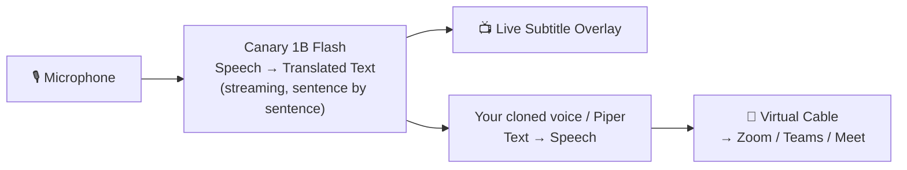
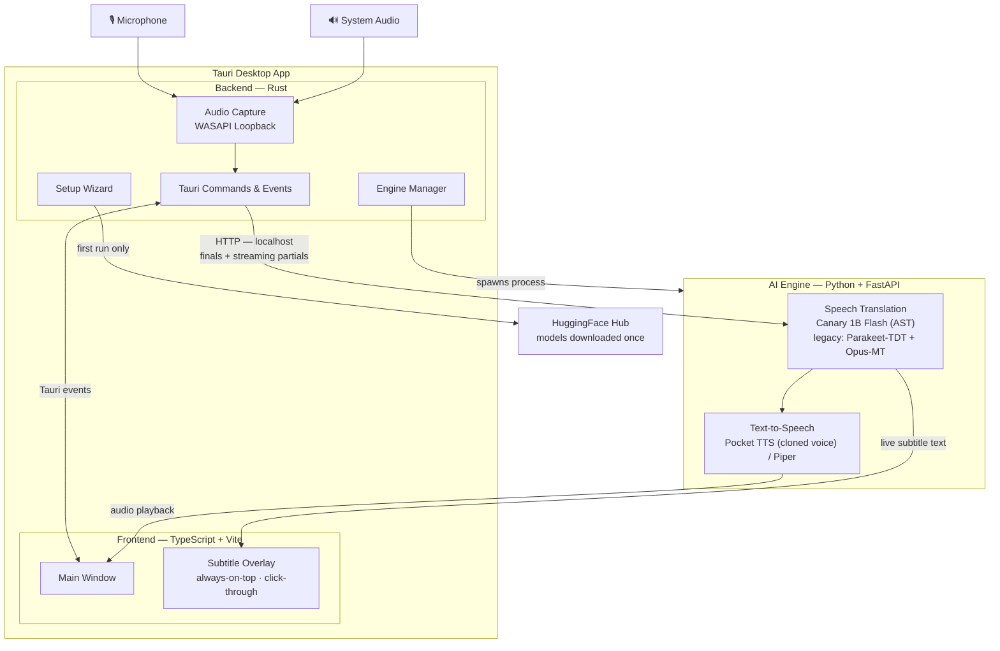

<p align="center">
  <picture>
    <source media="(prefers-color-scheme: dark)" srcset="src-tauri/icons/icon.png">
    
  </picture>
</p>

<h1 align="center">LiveTranslate</h1>

<p align="center">
  <strong>Speak in one language, be heard in another — in real time.</strong><br>
  100% local. No cloud. No API keys. No data leaves your machine.
</p>

<p align="center">
  <a href="#features">Features</a> •
  <a href="#quick-start">Quick Start</a> •
  <a href="#building-from-source">Build from Source</a> •
  <a href="#architecture">Architecture</a> •
  <a href="#contributing">Contributing</a>
</p>

<p align="center">
  
  
  
  
</p>

---

## What is LiveTranslate?

LiveTranslate captures audio from your microphone, transcribes it with a local AI model, and translates it in real time. The translation can be shown as an on-screen subtitle overlay and/or spoken aloud by a text-to-speech engine.

The main use case is **live video calls**: you speak in your language, LiveTranslate translates and plays the audio through a virtual audio cable, and the other person on Zoom, Teams, or Meet hears you in their language — with no interpreter and no cloud service involved.

### How it works

LiveTranslate works like a simultaneous interpreter — you don't have to stop
speaking for the translation to happen:

1. **Capture** — your microphone audio is captured directly by LiveTranslate.
2. **Translate as you speak** — [Canary 1B Flash](https://huggingface.co/nvidia/canary-1b-flash) translates speech to English text in a single pass (no separate transcription step). While you talk, in-progress translations stream to the subtitle overlay, and each finished sentence is detected and closed on the fly.
3. **Speak** — every closed sentence is voiced immediately — in **your own cloned voice** ([Pocket TTS](https://huggingface.co/kyutai/pocket-tts)) or a standard voice ([Piper TTS](https://github.com/rhasspy/piper)) — and played through a **virtual audio cable**: set that cable as your microphone in the video call app and the other person hears you in English, sentence by sentence, while you keep talking.



Everything runs locally on your machine. No audio or text is ever sent to the cloud.

### Virtual audio cable

To route the translated audio into a video call, you need a virtual audio cable driver:

- **[VB-Audio Virtual Cable](https://vb-audio.com/Cable/)** (free) — install it, then in your video call app select "CABLE Input" as the microphone.

Without the virtual cable, LiveTranslate still works — you see the subtitles and hear the translation through your speakers, but the other party on the call won't hear the translated audio.

---

## Features

### Simultaneous translation

- **Interpreter-style flow** — sentences are detected as you speak and voiced while you continue talking; no need to pause
- **Live subtitles** — the in-progress translation streams to the overlay and refines in real time
- **Microphone mode** — translate your own speech into another language
- **System audio mode** — capture audio from any app (Zoom, Teams, YouTube, Netflix, games)
- **English pass-through** — if you speak in English, LiveTranslate detects it and skips translation entirely; the original audio goes through unchanged
- **Push-to-talk** — hold a hotkey to translate, release to stop
- **On-screen subtitles** — transparent overlay sits above all windows, click-through, auto-hides
- **Audio playback (TTS)** — hear the translation spoken aloud (Piper voices)
- **Voice cloning** — record a short sample of your voice and have the translation spoken back in *your own* voice instead of a generic one (powered by [Pocket TTS](https://huggingface.co/kyutai/pocket-tts))

### 100% local & private

- All inference runs on your machine
- No cloud services, no API keys, no telemetry
- HuggingFace models downloaded once during setup
- Works completely offline after initial model download

### Self-contained setup

- One-click installer bundles a portable Python runtime
- Setup downloads and configures everything: Python, models, voices
- No manual Python installation, no `pip install`, no environment variables
- Survives app reinstalls (models cached in HuggingFace home directory)

### Push-to-talk (PTT) shortcut

The PTT shortcut is **user-configurable** — click the "Capture" button in settings and press any key combination (e.g. `CapsLock`, `Ctrl+Shift+Space`, `Ctrl+\`). No shortcuts are hardcoded.

In PTT mode: hold the shortcut to record, release to stop and translate.

---

## Quick Start

### Download the installer

Grab the latest `LiveTranslate_x64-setup.exe` from the [Releases page](https://github.com/NBS282/LiveTranslate/releases).

1. Run the installer
2. Launch LiveTranslate — the setup wizard will download Python and models automatically
3. Select your microphone or system audio device
4. Choose source and target languages
5. Start speaking — subtitles appear on screen

**Requirements:**
- Windows 10 or 11 (64-bit)
- ~4 GB free disk space (for Python runtime + models)
- Internet connection on first run (models download once, then fully offline)
- GPU with CUDA recommended but not required
- [VB-Audio Virtual Cable](https://vb-audio.com/Cable/) (free) — required to route translated audio into video calls

---

## Building from Source

### Prerequisites

- [Rust](https://rustup.rs/) (latest stable)
- [Node.js](https://nodejs.org/) 18+
- [pnpm](https://pnpm.io/)
- [Tauri CLI](https://v2.tauri.app/start/cli/)

### Steps

```bash
git clone https://github.com/NBS282/LiveTranslate.git
cd LiveTranslate

pnpm install
pnpm tauri dev      # development mode with hot-reload
pnpm tauri build    # production build
```

For detailed instructions, see [CONTRIBUTING.md](CONTRIBUTING.md).

---

## Architecture



### Tech Stack

| Layer | Technology |
|---|---|
| Frontend | Vanilla TypeScript, Vite |
| Desktop shell | Tauri 2 (Rust) |
| Audio capture | WASAPI loopback (Windows) |
| Speech translation | Canary 1B Flash (NVIDIA NeMo, speech→translated text in one pass) |
| Legacy fallback | Parakeet-TDT + Opus-MT (`LT_TRANSLATION_ENGINE=legacy`) |
| Text-to-speech | Pocket TTS (voice cloning) / Piper TTS |
| Engine server | FastAPI (Python 3.12) |

---

## Project Status

LiveTranslate is in active development. Current focus areas:

- [x] Windows installer (MSI + NSIS)
- [x] Spanish → English translation pipeline
- [x] Simultaneous translation — sentences voiced while you keep speaking (Canary 1B Flash)
- [x] Live streaming subtitles while you talk
- [x] Transparent subtitle overlay
- [x] Push-to-talk
- [ ] Multilingual support (NLLB-200 swap)
- [ ] Language selection UI
- [ ] Linux / macOS support
- [ ] Built-in model download manager
- [ ] Live keyboard output — type the translation as if you were physically typing it, so it appears in any text field on screen (chat, forms, live captions)
- [x] Voice cloning — instead of a generic TTS voice, the translated audio sounds like your own voice speaking the target language

---

## FAQ

**Does it work offline?**
Yes. After the first setup downloads the models, everything runs locally with no internet connection required.

**Does it require a GPU?**
No. It runs on CPU, but GPU acceleration (CUDA) significantly improves performance.

**What languages are supported?**
Currently Spanish → English. We're working on NLLB-200 for 200-language support in any direction.

**Is my data private?**
100%. Everything runs on your machine. No audio, text, or any data ever leaves your computer.

**Does it work with any video call app?**
Yes. LiveTranslate translates your microphone and plays the result through a virtual audio cable. You then select that cable as your microphone inside the call app. This works with any app that lets you choose an audio input — Zoom, Teams, Google Meet, Discord, and others.

**Can I use it to translate audio I'm listening to?**
Yes. System audio mode captures whatever is playing on your computer and shows you real-time subtitles of what's being said — useful for foreign-language content like videos, podcasts, or streams.

---

## Contributing

See [CONTRIBUTING.md](CONTRIBUTING.md) for detailed setup and guidelines.

**Quick summary:**
1. Fork and clone
2. `pnpm install`
3. Make your changes
4. Submit a PR with conventional commits

All contributions welcome — bug fixes, features, docs, tests.

---

## License

MIT © 2026 Nicolás B. S. — see [LICENSE](LICENSE) for details.
